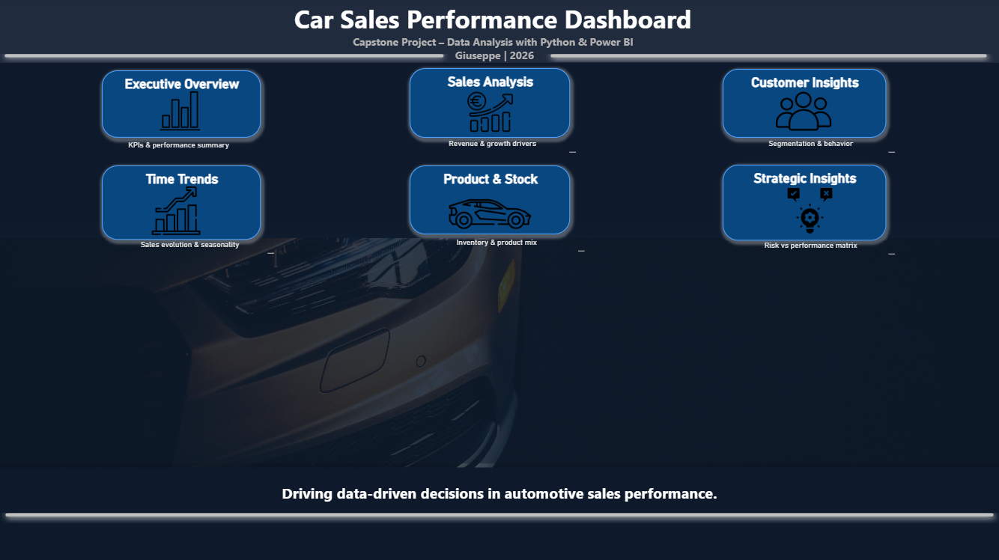
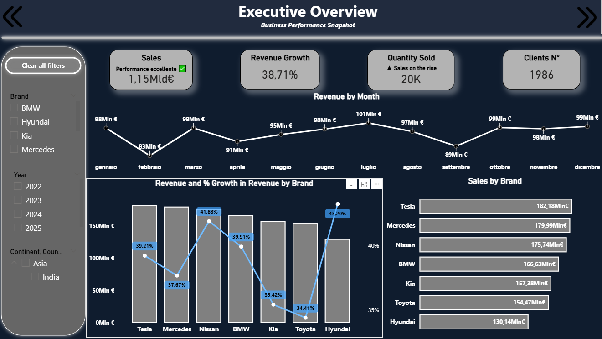
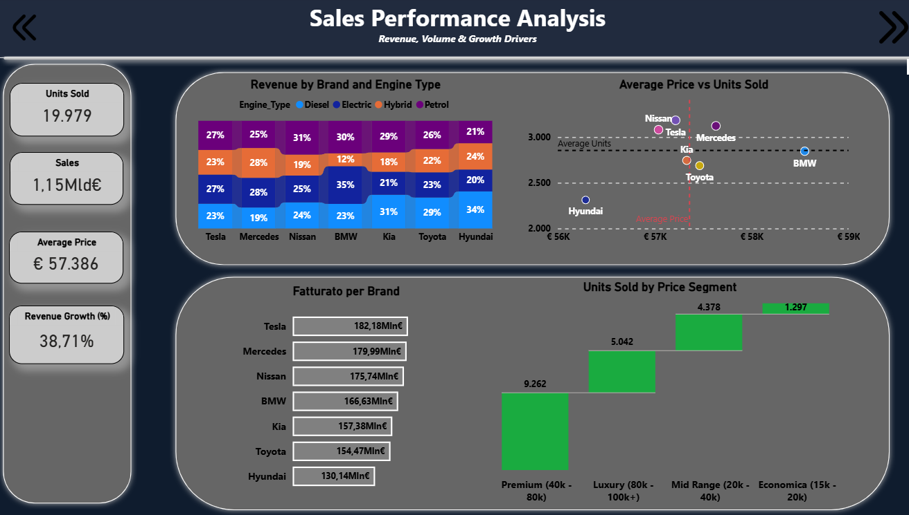
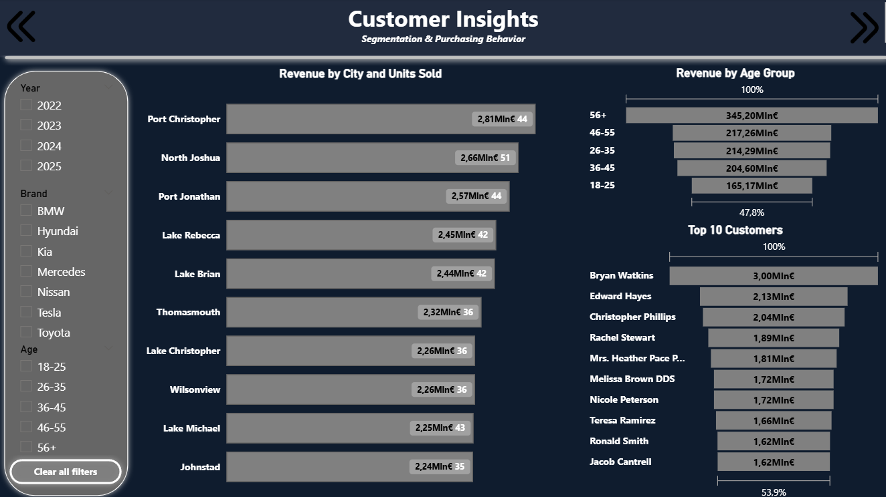
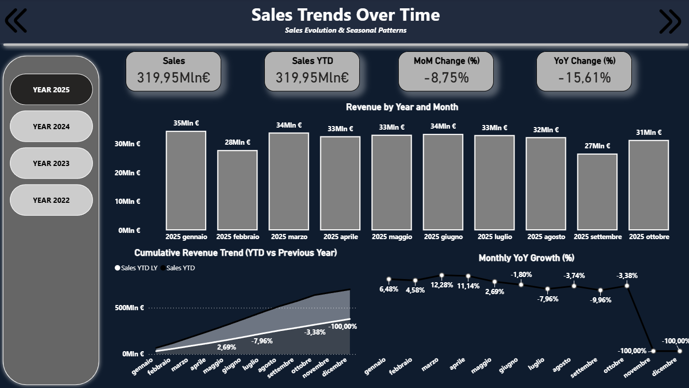
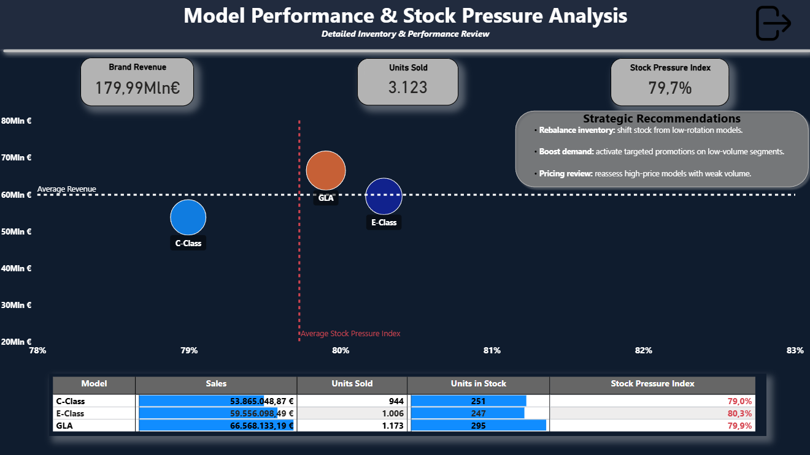
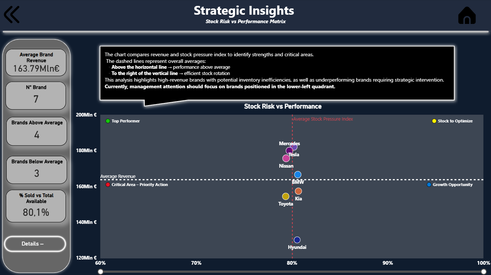
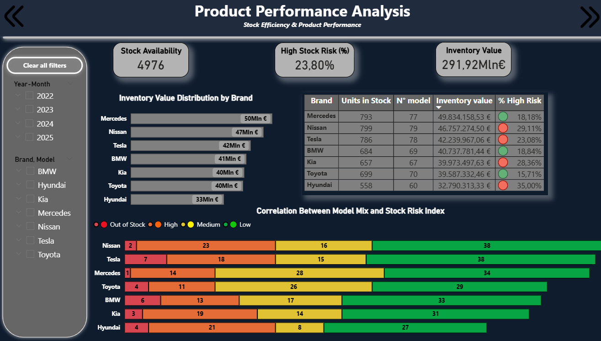
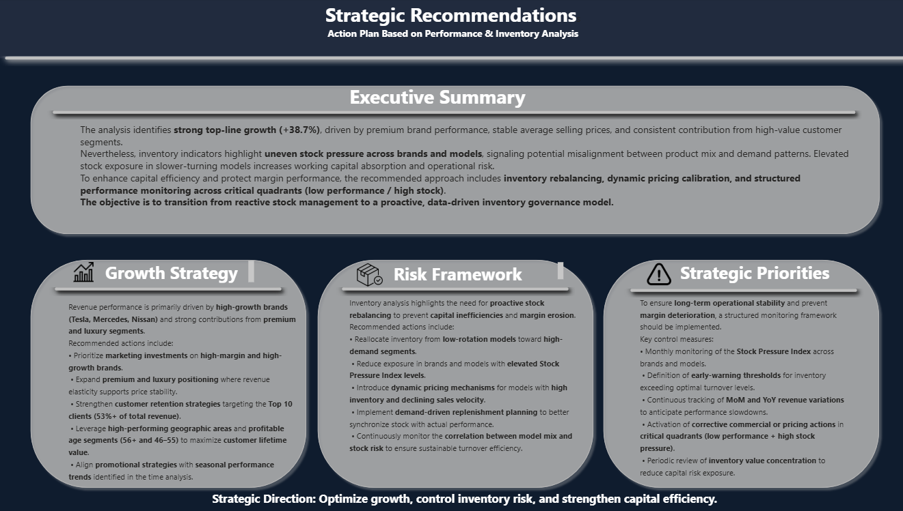

# 🚗 Car Sales Performance Analysis
### Capstone Project – Data Analysis with Python & Power BI  
**Author:** Giuseppe  
**Year:** 2026

---

# 📌 Project Overview

Questo progetto analizza le **performance di vendita, il comportamento dei clienti e l'efficienza dello stock** di una concessionaria automobilistica.

L’obiettivo è trasformare i dati operativi in **insight strategici** utili per supportare decisioni aziendali basate sui dati.

Il progetto utilizza:

- **Python** per il data cleaning
- **Power BI** per la dashboard interattiva

---

# 🏠 Dashboard Home



La home della dashboard funge da **hub di navigazione** e consente di accedere rapidamente alle diverse sezioni analitiche del progetto.

---

# 📊 Executive Overview



Questa sezione fornisce una panoramica generale delle performance della concessionaria.

KPI principali:

- Fatturato totale
- Revenue growth
- Numero clienti
- Quantità vendute

È presente inoltre l’andamento del **fatturato mensile** e la distribuzione delle vendite per brand.

---

# 🚘 Sales Performance Analysis



Questa pagina analizza i principali driver delle vendite.

Le analisi includono:

- fatturato per brand
- distribuzione delle vendite per tipo di motore
- relazione tra prezzo medio e unità vendute
- vendite per segmento di prezzo

Questo permette di comprendere **quali strategie di prezzo generano le migliori performance**.

---

# 👥 Customer Insights



La sezione Customer Insights analizza il comportamento dei clienti.

Include:

- fatturato per fascia di età
- vendite per città
- top clienti

Questo aiuta a identificare **i segmenti di clientela più profittevoli**.

---

# 📅 Sales Trends Over Time



Questa sezione analizza l’evoluzione delle vendite nel tempo.

Indicatori principali:

- Sales YTD
- Month over Month growth
- Year over Year growth

Il grafico permette di identificare **trend stagionali e variazioni delle vendite**.

---

# 📦 Model Performance & Stock Pressure



Questa sezione analizza la relazione tra:

- vendite dei modelli
- unità vendute
- stock disponibile

È stato sviluppato uno **Stock Pressure Index** per valutare l'efficienza della rotazione dello stock.

---

# 📊 Strategic Insights



Questo grafico mette in relazione:

- performance di vendita
- pressione dello stock

Lo scatter plot è diviso in quattro quadranti che permettono di individuare:

- top performer
- opportunità di crescita
- aree critiche di stock.

---

# 📦 Product & Stock Analysis



Questa pagina analizza nel dettaglio:

- valore dell’inventario
- unità disponibili in stock
- rischio di stock elevato
- distribuzione dei modelli per livello di rischio.

---

# 🎯 Strategic Recommendations



L’ultima sezione traduce i risultati dell’analisi in **raccomandazioni strategiche**.

Azioni suggerite:

- riallocazione dello stock
- revisione delle strategie di pricing
- monitoraggio dello stock pressure index
- focus sui brand con maggiore crescita.

---

# 🧹 Data Cleaning (Python)

Le principali operazioni di pulizia dei dati includono:

- rimozione valori nulli
- conversione dei tipi di dato
- pulizia colonne prezzo
- gestione duplicati
- conversione delle date

Esempio:

```python
import pandas as pd

df = pd.read_csv("sales.csv")

df = df.dropna()

df["Price"] = df["Price"].replace(r'[$,]', '', regex=True).astype(float)

df["Sale_Date"] = pd.to_datetime(df["Sale_Date"])

df = df.drop_duplicates()

# Conversione data
df["Sale_Date"] = pd.to_datetime(df["Sale_Date"])

# Verifica duplicati
df = df.drop_duplicates()
